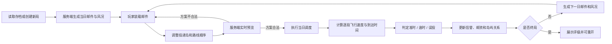
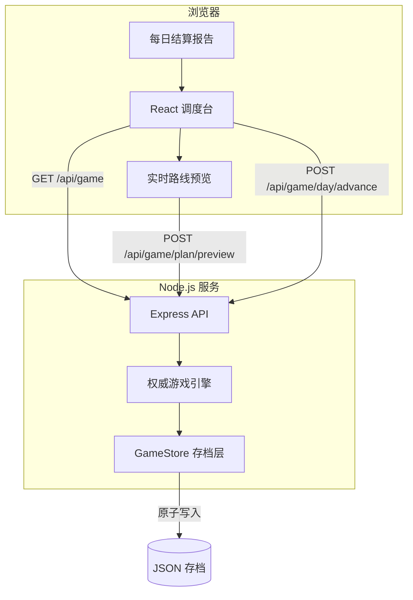
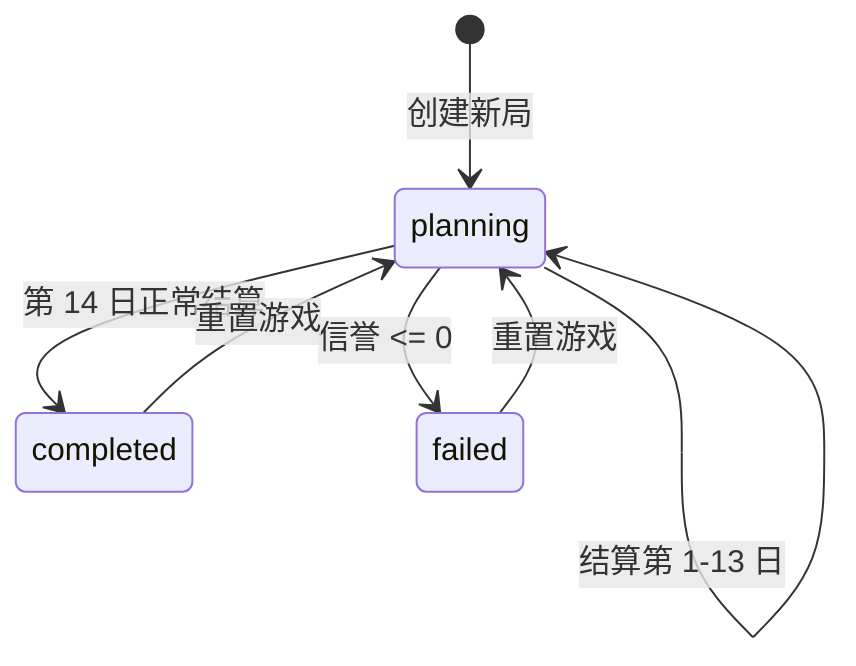

# 浮空岛邮政调度员

## 1. 项目说明

“浮空岛邮政调度员”是一套可直接运行的完整游戏，不是静态演示或数据假页面。React 负责调度面板与交互，Node.js 负责邮件生成、路线计算、每日结算、角色关系演化和存档持久化。前端展示的所有游戏数据都来自服务端，未使用写死的演示状态。

玩家需要在 14 个游戏日内：

1. 查看当天来自浮空岛的邮件。
2. 根据风向、邮件重量、紧急程度和截止时间，把邮件装到三艘信使艇上。
3. 为每封邮件选择投递岛并调整航线顺序。
4. 根据服务端实时预览修正超载、超量、逾时和误投风险。
5. 执行当日调度，查看逐封邮件回报和岛屿关系变化。
6. 维持邮政信誉，争取高等级终局。

游戏有完整开始、进行、结算、终局和重开闭环。

## 2. 技术栈

| 层级 | 技术 | 职责 |
| --- | --- | --- |
| 前端 | React 19、Vite 7 | 地图、邮件面板、路线调整、结算报告、终局界面 |
| 后端 | Node.js 20.19+、Express 5 | 权威游戏状态、规则校验、路线模拟、每日结算 |
| 持久化 | JSON 文件 + 原子写入 | 在每个已结算日结束后保存进度 |
| 测试 | Node.js 内置 `node:test` | 规则、终局、API 闭环、存档恢复 |
| 运行方式 | 开发态双进程 / 生产态单进程 | Vite 热更新；生产构建由 Node 静态托管 |

本项目没有数据库、第三方游戏服务或外部模型依赖。Node.js 服务是唯一规则权威，不存在“前端算一套、后端算另一套”的情况。

## 3. 快速运行

### 3.1 环境要求

- Node.js 20.19 或更高版本
- npm 10 或更高版本

### 3.2 安装依赖

```bash
npm install
```

### 3.3 开发模式

```bash
npm run dev
```

- React 调度台：`http://localhost:5173`
- Node.js API：`http://localhost:3001`
- Vite 会把 `/api` 请求代理到 Node.js 服务。

### 3.4 生产模式

```bash
npm run build
npm start
```

生产模式由 Node.js 同时提供 API 和 `dist/` 构建产物，访问：

```text
http://localhost:3001
```

可通过环境变量修改端口和存档位置：

```bash
PORT=8080 DATA_FILE=/var/lib/sky-post/game-state.json npm start
```

### 3.5 测试与完整校验

```bash
npm test
npm run check
```

`npm run check` 会依次执行服务端测试和生产构建，任一步失败都会返回非零退出码。

## 4. 游戏闭环

### 4.1 日循环



### 4.2 终局条件

- 14 日全部结算完成：游戏成功结束，按最终信誉评为 `S / A / B / C`。
- 信誉降至 0 或以下：游戏失败，进入“邮路停摆”终局。
- 任一终局出现后，服务端拒绝继续结算，必须重新开局。

### 4.3 闭环保证

- 每次结算都会写入磁盘，刷新页面或重启 Node.js 后进度仍存在。
- 终局后不能继续修改或提交当天方案。
- 错误方案不会修改存档，接口返回明确的业务错误。
- 预览与正式结算共用同一套规则函数，预览中的预计到达时间即可用于决策。
- 运行时不注入假的岛屿、邮件或结算结果；初始世界和每日事件均由固定种子的生成器产生。
- 重新开局会创建新的随机种子和全新世界状态。

## 5. 游戏规则

### 5.1 世界构成

世界包含：

- 1 个中央起点：天枢邮港。
- 4 个收件岛：曦光岛、风翎岛、雾礁岛、铸炉岛。
- 3 艘信使艇，每艘有不同载重、最大邮件数和基础航速。
- 6 组双侧岛屿关系，初始关系值各不相同。
- 每个游戏日 5 至 7 封邮件。

岛屿特性会影响航线：

- 曦光岛清晨有雾，9:00 前抵达的航段额外增加 0.25 小时。
- 风翎岛外有乱流，抵达速度降低 12%。
- 雾礁岛低云严重，每封投往该岛的邮件增加 0.35 小时。
- 铸炉岛重货较多，需要合理使用高载重信使。

### 5.2 邮件属性

每封邮件包含：

- 唯一编号。
- 发件岛和收件岛。
- 发件人和主题。
- 重量 `0.5 - 6.2 kg`。
- 紧急度 `1 / 2 / 3`。
- 截止日和截止小时。

紧急度决定基础截止时间：

| 紧急度 | 标签 | 当日截止时间 |
| --- | --- | --- |
| 3 | 加急 | 12:00 |
| 2 | 优先 | 18:00 |
| 1 | 常规 | 22:00 |

积压邮件跨日后仍可投递，但已经超过原定截止日，因此必定记为逾时。

### 5.3 信使约束

| 信使 | 载重 | 最大邮件数 | 基础航速 | 特点 |
| --- | ---: | ---: | ---: | --- |
| 风信子号 | 11 kg | 5 封 | 82 km/h | 速度与载量均衡 |
| 重峦号 | 20 kg | 4 封 | 62 km/h | 载重高，满载和逆风损失明显 |
| 彗尾号 | 7 kg | 3 封 | 97 km/h | 适合少量轻邮件和加急件 |

方案校验规则：

- 同一封邮件不能出现两次。
- 邮件必须处于待处理或积压状态。
- 每艘信使不得超过邮件数量上限。
- 每艘信使不得超过载重上限。
- 投递岛必须是 4 个收件岛之一。
- 游戏必须处于 `planning` 阶段。

### 5.4 路线计算

每艘信使从 07:00 自天枢邮港出发，按照玩家设置的顺序逐岛飞行。单段距离使用地图坐标缩放后的欧氏距离。

单段有效速度近似为：

```text
有效速度 = 基础速度 × (1 - 0.34 × 当前总载重率)
         + 风速 × 航向与风向余弦值 × 0.78
```

随后应用岛屿特性修正，并限制在 `24 - 118 km/h`。到达时间为：

```text
本段到达时间 = 上段到达时间 + 本段距离 / 有效速度 + 特殊天气延误
特殊天气延误 = 雾礁岛 0.35 小时 + 曦光岛 09:00 前 0.25 小时
```

系统据此判定：

- 目标岛与原收件岛不同：误投。
- 当前日超过截止日，或到达小时晚于截止小时：逾时。
- 否则：准时送达。

### 5.5 关系与信誉

准时送达：

```text
信誉变化 = +紧急度
邮资变化 = +紧急度 × 6
发件岛—收件岛关系 = +1 + 紧急度
```

逾时送达：

```text
信誉变化 = -1
邮资变化 = max(1, 4 - 紧急度)
发件岛—收件岛关系 = +1
```

误投：

```text
信誉变化 = -(2 + 紧急度)
邮资变化 = -紧急度 × 2
发件岛—收件岛关系 = -(3 + 紧急度 × 2)
```

未安排邮件会积压，并按紧急度扣减信誉和邮资。同一封积压邮件在后续日期仍未处理时会再次产生积压损失。邮政信誉始终限制在 `0` 至 `100`，邮资不能低于 `0`，所有岛屿关系限制在 `-100` 至 `100`。预览与正式结算使用相同的边界截断结果。

## 6. 系统架构



### 6.1 前后端边界

- React 不保存权威游戏进度，只保存当前页面上的未提交调度方案。
- Node.js 负责邮件生成、校验、速度计算、结算和关系变化。
- 页面刷新时，未提交方案会丢失，但所有已经结算的日期永久保存在存档中。
- 预览接口是只读操作，不写磁盘。
- 结算接口在一个受控状态副本上执行；规则抛错时不会覆盖原存档。

### 6.2 状态机



## 7. 项目结构

```text
.
├── client/
│   ├── index.html
│   └── src/
│       ├── App.jsx                     # 页面状态、调度交互、结算动作
│       ├── api.js                      # HTTP 请求封装
│       ├── main.jsx                    # React 入口
│       ├── styles.css                  # 响应式调度台样式
│       ├── utils.js                    # 前端通用格式化工具
│       └── components/
│           ├── FleetPanel.jsx          # 信使载重和路线顺序
│           ├── LetterCard.jsx          # 邮件卡片
│           ├── MapPanel.jsx            # 岛屿地图与路线
│           ├── RelationsPanel.jsx      # 岛屿关系
│           ├── ReportDialog.jsx        # 每日结算报告
│           └── WeatherPanel.jsx        # 风向罗盘
├── server/
│   ├── app.js                          # Express 应用和路由
│   ├── engine.js                       # 权威游戏规则
│   ├── index.js                        # 服务入口
│   ├── store.js                        # 原子存档
│   └── tests/
│       ├── api.test.js                 # HTTP API 与持久化测试
│       ├── client-utils.test.js        # 前端时间格式化测试
│       └── engine.test.js              # 规则和终局测试
├── dist/                               # 生产构建产物（运行 build 后生成）
├── package.json
├── package-lock.json
├── vite.config.js
└── 项目文档.md
```

## 8. HTTP API

### 8.1 健康检查

```http
GET /api/health
```

响应示例：

```json
{
  "ok": true,
  "phase": "planning",
  "day": 1,
  "version": 1
}
```

### 8.2 获取游戏状态

```http
GET /api/game
```

返回完整公开状态，包括当前风况、邮件、关系、信使、历史摘要和终局信息。

### 8.3 预览方案

```http
POST /api/game/plan/preview
Content-Type: application/json
```

```json
{
  "assignments": [
    {
      "letterId": "L01-01",
      "courierId": "comet",
      "targetIslandId": "mist",
      "order": 0
    }
  ]
}
```

返回内容：

- `valid`：方案是否合法。
- `issues`：载重、邮件上限、重复邮件等阻断问题。
- `warnings`：积压、逾时和误投风险。
- `routes`：每艘信使的逐段速度、距离和到达时间。
- `projection`：预计信誉、邮资和关系变化。
- `unassignedLetterIds`：尚未安排的邮件。

该接口不改变游戏进度。

### 8.4 执行当日调度

```http
POST /api/game/day/advance
Content-Type: application/json
```

请求体必须同时携带预览接口中的 `assignments`，以及从当前游戏状态读取到的 `expectedRevision`：

```json
{
  "assignments": [
    {
      "letterId": "L01-01",
      "courierId": "comet",
      "targetIslandId": "mist",
      "order": 0
    }
  ],
  "expectedRevision": 0
}
```

成功后返回：

- `report`：当天逐封邮件结果和实际关系变化。
- `state`：结算后的最新游戏状态，其中 `revision` 已经递增。

如果方案非法，服务端返回 HTTP 400，响应中的 `issues` 说明原因，存档保持原样。如果 `expectedRevision` 与当前进度不一致，服务端返回 HTTP 409，防止双击、重试或旧页面重复跨越游戏日；重新开局也会递增 `revision`，避免旧请求命中新局。

### 8.5 重新开局

```http
POST /api/game/reset
Content-Type: application/json
```

```json
{
  "seed": "optional-fixed-seed"
}
```

不传 `seed` 时会使用当前时间创建新随机局。

## 9. 数据持久化

默认存档路径：

```text
server/data/game-state.json
```

写入过程：

1. `GameStore` 复制当前内存状态。
2. 游戏引擎在副本上完成结算。
3. 副本写入同目录临时文件。
4. 使用文件系统重命名操作替换正式存档。
5. 成功后才把新状态切换到内存。

这样可以避免进程在写入一半时留下损坏 JSON。若已有存档无法解析，服务会：

1. 将损坏文件改名为 `game-state.json.corrupt-时间戳`。
2. 创建一份新局。
3. 在首次响应中附带恢复说明。

存档文件不提交到版本库，已由 `.gitignore` 排除。

## 10. 前端交互说明

- 左侧地图实时绘制当前已分配的信使路线。
- 风况罗盘显示风向和风速，路线预览使用同一风向计算速度。
- 邮件卡展示紧急度、重量、原发地、目的地和截止时间。
- 点击信使名称把邮件加入对应航线。
- 每艘信使卡片显示载重进度、邮件上限、预计出港和返航时间。
- 路线中的投递目标可以修改。选择非原收件岛会明确显示误投结果。
- 路线顺序可通过上下按钮调整，服务端会按顺序重算所有航段。
- 页面底部的调度坞始终显示预计信誉、邮资、延误、误投和未安排数量。
- 结算后弹出逐封邮件报告和关系变化；终局出现独立评级界面。

## 11. 错误处理

- 前端请求失败会显示全局错误条，保留当前可编辑方案。
- 非法方案在结算前被服务端拒绝，不会产生部分结算。
- 未找到的路由统一返回 JSON 404。
- 请求体限制为 100 KB，避免异常大负载。
- JSON 解析失败和业务规则错误均由统一错误中间件返回结构一致的响应。
- 服务收到 `SIGINT` 或 `SIGTERM` 时会优雅关闭 HTTP 连接。

## 12. 自动化验证

当前测试覆盖：

1. 固定种子可复现相同的邮件和风况。
2. 信使载重和邮件数量上限会被校验。
3. 误投确实降低对应岛屿关系。
4. 同一封邮件重复分配时无法结算。
5. 空方案仍能形成积压、结算并进入下一日。
6. 14 日会进入明确终局，不会无限运行。
7. HTTP API 能完成读取、预览、结算和重置。
8. 新 `GameStore` 实例能从磁盘恢复进度。
9. 邮件不会自寄，同一日不会出现重复方向路线。
10. 非法航线顺序会被明确拒绝。
11. 关系触底时结算报告记录实际变化量。
12. 每次结算和重新开局都会递增防重放版本号。
13. 时间格式不会产生 `60` 分钟。
14. 损坏或结构不完整的存档会备份恢复。
15. 重复跨越游戏日会返回 HTTP 409。
16. 信誉会正确封顶在 `100`，预览值与结算值一致。
17. 终局报告或结局字段不完整时会被识别为损坏存档。
18. 旧存档中的越界信誉、邮资和关系会在加载时迁移并写回。
19. 逾时投递会正确扣减信誉并保留基础关系修复。
20. 信誉降到零会进入失败终局并停止生成下一日邮件。

运行：

```bash
npm test
```

完整发布前检查：

```bash
npm run check
```

## 13. 真实运行验收清单

- [x] `npm install` 可安装全部依赖。
- [x] `npm run dev` 同时启动 React 和 Node.js。
- [x] `npm run build` 能生成生产前端。
- [x] `npm start` 能由 Node.js 托管页面和 API。
- [x] 首局可自动创建存档。
- [x] 邮件和风况由服务端真实生成。
- [x] 玩家可以装载、换岛、调整顺序和移出邮件。
- [x] 服务端会拒绝重复、超载和超量方案。
- [x] 预览结果与正式结算使用同一引擎。
- [x] 误投会改变岛屿关系。
- [x] 每日结算会持久化。
- [x] 服务重启后可恢复进度。
- [x] 14 日结束或信誉归零时进入终局。
- [x] 可以重新开局。
- [x] 自动化测试全部通过。

## 14. 可扩展方向

以下是扩展方向，不影响当前完整闭环：

- 为每座岛增加独立天气和季节性事件。
- 增加信使维护、燃料和租用成本。
- 增加玩家可接受/拒绝的特殊委托。
- 增加关系阈值触发的贸易、禁航或援助事件。
- 将 JSON 存档替换为 PostgreSQL，同时保持 `GameStore` 接口。
- 增加账号系统与多人排行榜。

当前版本已经具备独立运行、决策反馈、持久化和终局所需的全部环节，可以作为正式游戏版本部署。
